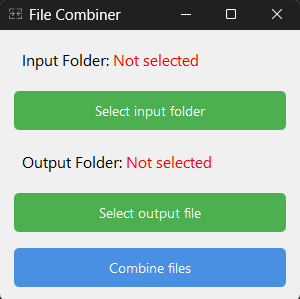

# File Combiner Application

A Python-based desktop application built with **PySide6** for combining text files from a selected folder into a single output file.

This is a simple tool designed to contribute to making tasks easier for the hardware area in my current job.

---

## Features

- Simple and user-friendly interface.
- Select a folder containing input text files.
- Choose the name and location of the output file.
- Combine all text files in the selected folder into the output file.
- Error handling for empty folders or invalid file paths.

---

## Screenshots


*The main interface of the File Combiner application.*

---

## Installation

### Prerequisites

- Python 3.8 or higher installed on your system.
- Recommended: A virtual environment for isolating dependencies.

### Steps

1. Clone this repository:
    ```bash
    git clone https://github.com/your-username/file-combiner.git
    cd file-combiner
    ```
2. Create and activate a virtual environment (optional but recommended):
    ```bash
    python -m venv venv
    source venv/bin/activate   # On Windows: venv\Scripts\activate
    ```
3. Install dependencies:
    ```bash
    pip install -r requirements.txt
    ```
4. Run the application:
    ```bash
    python app.py
    ```

---

## Usage

1. **Launch the application:**
   - Double-click the `.exe` file if you have packaged the app (instructions below).
   - Alternatively, run `python app.py` to start the app in your development environment.

2. **Select the input folder:**
   - Click on "Elija carpeta entrada" to choose the folder containing the text files to combine.

3. **Select the output file:**
   - Click on "Elija nombre y extension archivo salida" to specify the name and location of the combined file.

4. **Combine the files:**
   - Click on "Combinar archivos" to merge the contents of all text files in the folder into the specified output file.

---

## Packaging the Application as an Executable

To distribute the application without requiring Python:

1. Install PyInstaller:
    ```bash
    pip install pyinstaller
    ```
2. Package the application:
    ```bash
    pyinstaller --onefile --windowed --icon=assets/combine.ico app.py
    ```
3. Find the packaged `.exe` file in the `dist/` directory.

---

## Folder Structure

```
file-combiner/
├── app.py                # Entry point for the application
├── combine.py            # Functionality for combining text files
├── main_window.py        # MainWindow class definition
├── ui_components.py      # Helper functions for UI
├── requirements.txt      # Project dependencies
├── assets/               # Folder for assets (e.g., icons, screenshots)
│   ├── combine.ico       # Application icon
│   └── screenshot_main_window.png # Screenshot for the README
```
---

